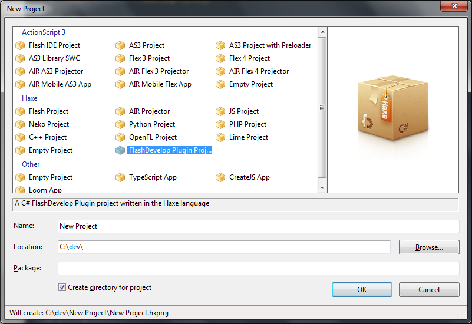

# FD_PluginTemplate

A FlashDevelop Project Template to build FD plugins in Haxe.

## Dependencies

- Haxe `3.2.1`+
- Visual Studio 2015 Community Edition
- My `hxcs` fork:
	- `haxelib git hxcs https://github.com/skial/hxcs.git fd_plugin_dll`

## Install

Download the current release -  [`v1.0.0-alpha`](https://github.com/skial/FD_PluginTemplate/releases/tag/v1.0.0-alpha) - and open. FlashDevelop will ask you if it should
install the file.
